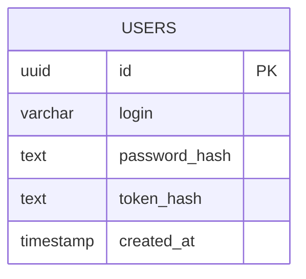
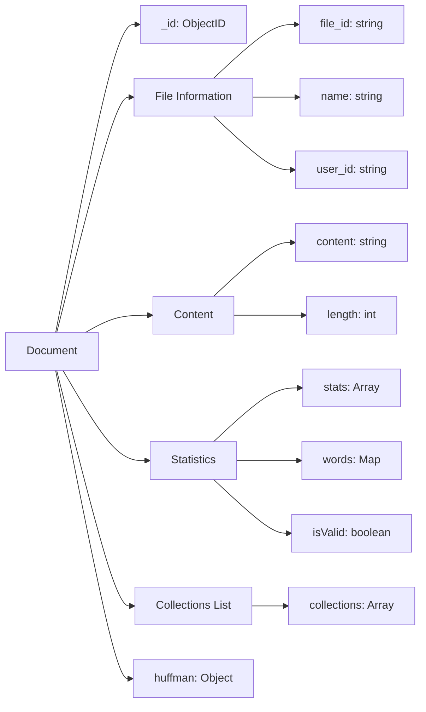
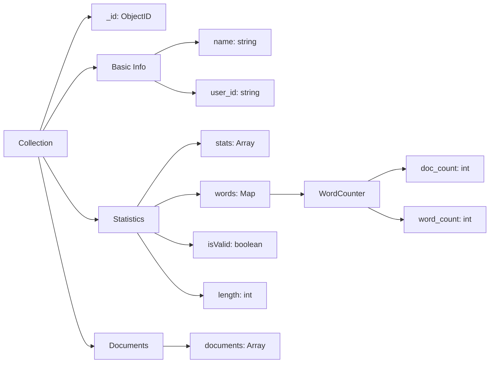

# TF-IDF Document Analyzer

Сервис для анализа текстовых документов с использованием алгоритма TF-IDF. Позволяет загружать документы, анализировать частотность слов и управлять коллекциями документов.

## Features

- 📊 Анализ документов с помощью TF-IDF
- 🔐 JWT аутентификация
- 📁 Управление коллекциями документов
- 📈 Статистика использования слов
- 🗜️ Сжатие текста алгоритмом Хаффмана
- 📊 Метрики использования API

## Tech Stack

- Go (Gin Framework)
- PostgreSQL
- MongoDB
- nGinx
- Docker & Docker Compose
- JWT Authentication
- Swagger Documentation

## Quick Start

### Предварительные требования

- Docker и Docker Compose
- Нормальная операционная система(не windows)

### Установка и запуск

1. Клонируйте репозиторий:
```bash
git clone https://github.com/PushinMax/lesta-tf-idf-go.git
cd lesta-tf-idf-go
```

2. Сгенерируйте файл конфигурации:
```bash
sh scripts/generate_env.sh
```

3. Запустите приложение:
```bash
docker-compose up -d --build
```

## API Documentation

API документация доступна по адресу `/swagger/index.html` после запуска приложения.


## Демо

Демо версия приложения доступна по адресу: [37.9.53.117:80](http://37.9.53.117:80)

## Development

### Структура проекта

```
.
├── cmd/            # Точка входа приложения
├── internal/       # Внутренняя логика
│   ├── encoding/   # Логика сжатия документов
│   ├── handler/    # HTTP обработчики
│   ├── repository/ # Слой работы с БД
│   ├── server/     # Запуск сервера
│   └── service/    # Бизнес-логика
├── migrations/     # SQL миграции
└── scripts/        # Вспомогательные скрипты
```

## License

MIT

## Changelog

С changelog-ом вы можете ознакомиться [тут](docs/CHANGELOG.md) и дополнить его своим комментарием

## Schema Database

### PostgreSQL Users Table


### MongoDB Collections

#### Document Structure


#### Collection Structure


## Contact

При возникновении вопросов или проблем создавайте issue в репозитории проекта.