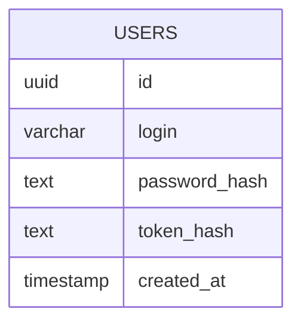
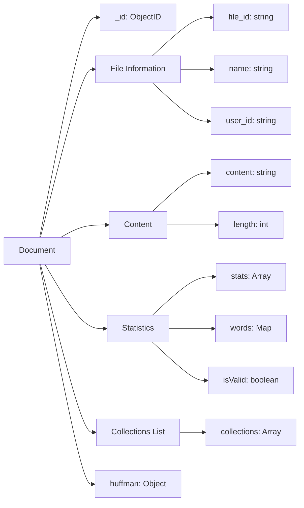
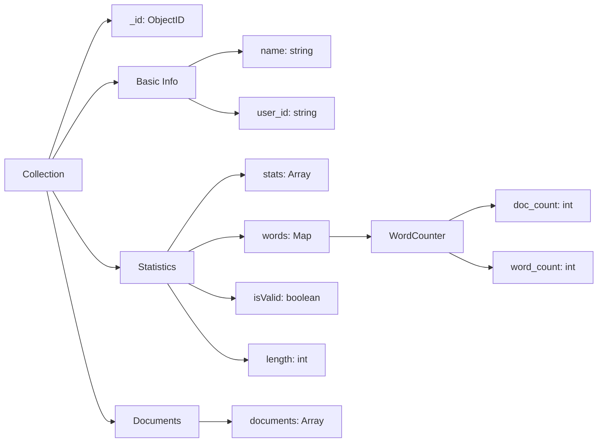

# Техническая документация проекта

Здесь я хочу расписать принцип работы разных частей системы.
## Identity
Информация о пользователях храниться в базе данных posgreSQL в следующем формате:

При регистрации пользователь должен выбрать уникальный логин и ввести пароль(единственное ограничение на пароль это его способность быть захешированным с "солью", единственное известное мне ограничение это длинна не более 72 символов)

При входе в систему пользователь вводит свой логин и пароль, и система проверяет сначала есть ли пользователь с таким логином, потом сравнивает присланный пароль с лежащим хешом. В случае успеха сервер генерирует пару ключей JWT, и в базу записывает данные о последнем выданном refresh_token: его хеш и время выдачи. Из важных особенностей, в оба токена я зашиваю id пользователя, и таким образом при обращении к защищенному api пользователь не обязан сам вводить свой id, а система будет вытаскивать его из токена.

Спустя n минут(60 минут по умолчанию, можно изменить в файле [config.yml](../configs/config.yml)) access_token станет не валидным, и клиент обязан его заменить операцией refresh, получив новую пару токенов. В базе будет перезаписанна информация о новом выданом токене.

Для logout необходимо предоставить свой access_token и система сотрет ваш refresh_token из базы данных.

Процесс смены пароля и удаления аккаунта также требует access_token. При удалении аккаунта, удаляются все файлы и коллекции пользователя.

## Metrics
Система собирает базовые метрики, а именно:
1) Количество запросов к серверу
2) Среднее время запроса к серверу
3) Время последнего обращения к сервису

## Documents/Collections
Документы хранятся в базе данных в следующем формате:

В данной коллекции построен индекс (user_id, file_id)
Он эффективен, поскольку каждый запрос к базе всегда ищет документы касающиеся определенного пользователя, а заодно и конкретный его файл.

Поскольку статистика файла напрямую зависит от коллекций, в который фаил содержится, я решил что будет важно как хранить map с подсчитанным словами в файле для быстро пересчета, так и последнюю вычесленную статистику с флагом valid. В случае если флаг равен true, мы просто возвращаем уже посчитанную статистику, иначе же пересчитываем. Там образом процесс подсчета конечной статистики происходит только в момент запроса, и никакую статистику мы не пересчитываем, если данные не поменялись.
Такой же принцип применяется к коллекциям

В качестве file_id выступает случайно сгенерированная последовательность из 12 байт.

В данной коллекции mongo построен индекс (user_id, collection_name) по той же причине, что и в коллекции документов.

В качестве collection_id/collection_name выступает просто выбранное название пользователем. Это удобно для красивого URI, и безопастно, так как знание имени коллекции не даст возможность получить к ней доступ.

К документам и коллекциям созданым пользователем имеет доступ только сам пользователь. Если злоумышленник перехватит file_id, или collection_id, то он не сможет получить к ним доступ без авторизации.

В качестве дополнительных ручек было добавленно api для создания и удаления коллекций, подробнее с использованием которого можно ознакомиться через swagger.

